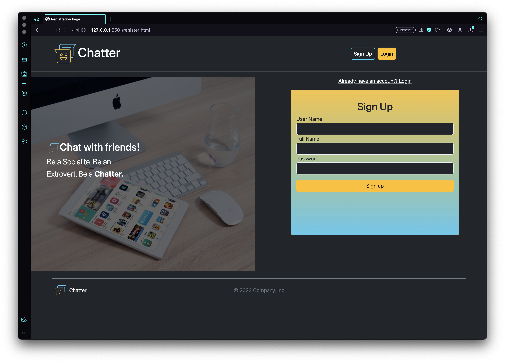
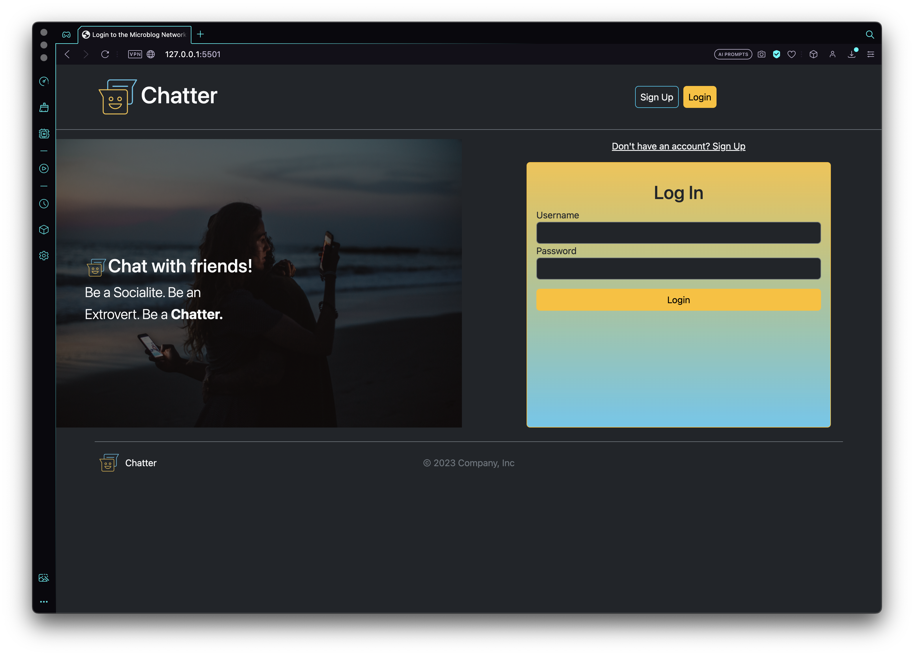
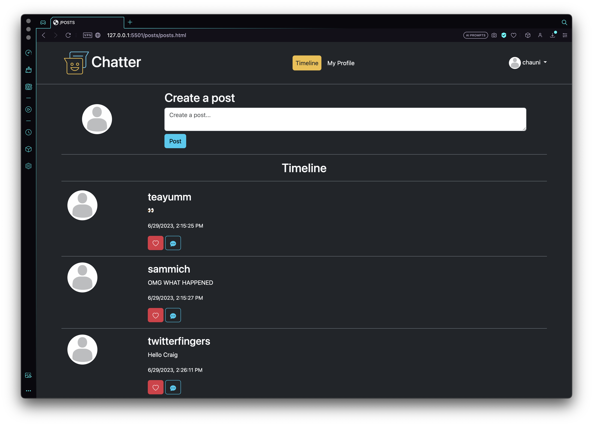
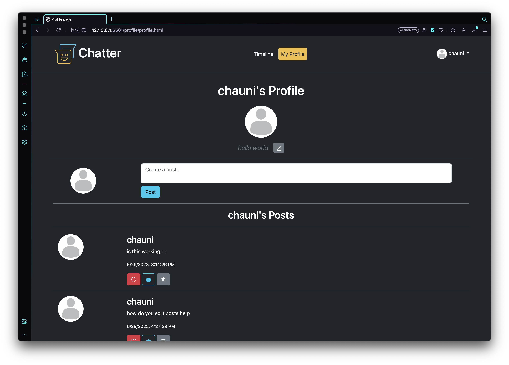

# Enjoy the Microblog Project and the MicroblogLite API!

Don't forget to read the [*MicroblogLite* API docs](https://microbloglite.herokuapp.com/docs/) and experiment with the API in *Postman!*

Practice and experimentation provide experience, and experience provides confidence.

## Collaborators
Chauni Brown (https://github.com/chauni)
Ariel Kelbore (https://github.com/Kelbore)
Alejandro R. (https://github.com/MrCodeA007)

# Microblog Site Capstone 3

# Sign Up/Login
- The register/sign up form allows the user to create an account on this microblogging site, Chatter. Once an account is created, the user is redirected to the login page.

- Once at the login page, the user is able to input their username and password and is then redirected to the Posts/Timeline page.

# Posts/Timeline

  - The posts/timeline and profile pages are only accesible when the user is logged in; if they are not logged in they are redirected to the login page.

  - On the posts/timeline page a dropdown in the navbar featuring the logged in user's username. This dropdown provides options such as
    - Profile (which directs the user to their profilee page)
    - Settings (a decorative placeholder)
    - and a 'Log Out' button (that logs the user out, and redirects them to the login page)
    
  - This page also allows the logged in user to create a post, as well as view posts from all users. Each post displays:
    - the posters username 
    - body of their post 
    - a timestamp,
    - a like button
    - and finally, a decorative comment button.

# Profile

  - This page allows the logged in user to view their profile. On this page they can edit their bio, make a post, and view all of their own posts. This page also allows them to delete their own posts.

